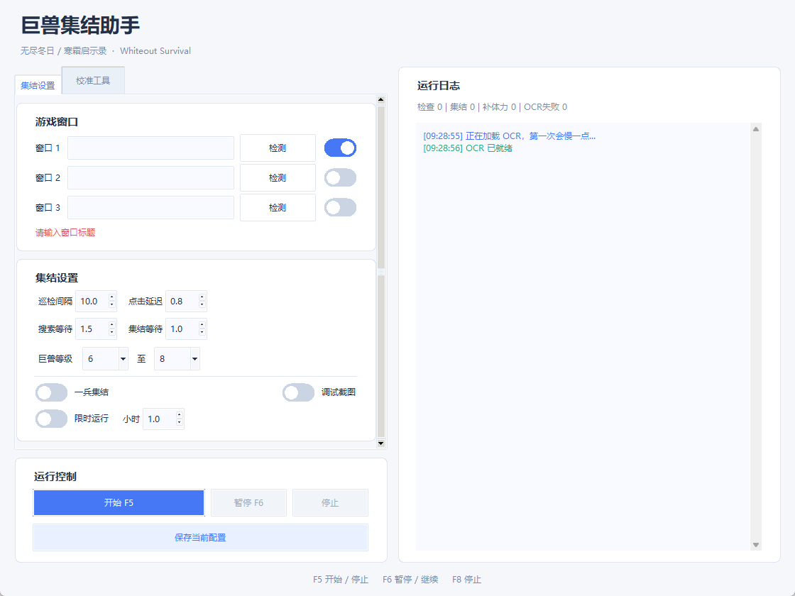
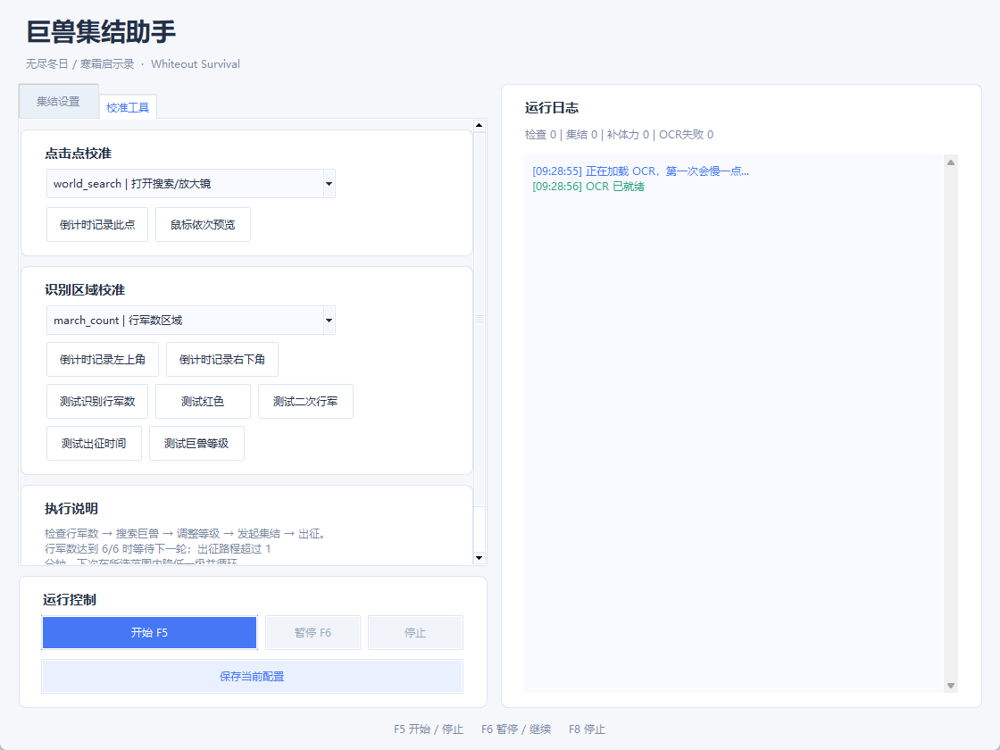

# 无尽冬日 / 寒霜启示录 巨兽集结助手 | Whiteout Survival Beast Rally Helper

Windows 桌面巨兽集结工具：白色简洁界面，支持最多三个游戏窗口轮巡、行军数 OCR、自动搜索与发起集结、一兵集结、限时运行，以及点击点和识别区域校准。

Windows desktop assistant with up to three-window cycling, march-count OCR, beast search and rally actions, one-soldier mode, runtime limits and coordinate calibration. The UI is in Chinese.

[English guide](docs/README.en.md) · [下载完整版本 / Releases](https://github.com/zha-qd/beast-rally-helper/releases)



## 下载与启动

1. 从 Releases 下载 **`beast-rally-helper-v1.0.0-windows-x64.zip`**，完整解压至可写目录。
2. 双击 `start.bat`。便携包已附 Python 3.10、依赖和中文 OCR 模型，无需另外安装 Python。
3. 打开游戏野外地图，保证行军数区域可见、无遮挡。
4. 输入窗口标题，开启对应窗口开关，点击“检测”。发布版窗口名默认空白；至少填写一个准确且唯一的标题片段。
5. 使用“校准工具”检查点击点与识别区域，先测试行军数识别，再小批量运行。
6. 在“集结设置”选择等级、运行时间等参数，点击“保存当前配置”。
7. 点击“开始 F5”或按 **F5**；再按 F5 停止。F6 暂停／继续，F8 只停止。

不要在压缩包里直接运行。GitHub 自动生成的 `Source code` ZIP 以及单独源码包不包含运行环境和模型，普通用户应下载 Windows 完整包。

## 使用条件

- Windows x64；本包使用 Python 3.10、PaddleOCR 2.7.0.3、PaddlePaddle 2.6.2。
- 针对已校准的竖屏游戏界面，不是通用跨游戏自动定位工具。
- 实际截取桌面并操作鼠标；不支持最小化或被其他窗口遮住的后台识别。
- 多窗口轮巡会尝试激活目标窗口。多个窗口应具有一致布局和比例，标题需要能分别匹配。
- 运行期间不要手动移动、缩放游戏窗口，也不要与其他鼠标脚本同时运行。
- 先小批量观察识别及点击是否正确；界面版本、DPI、标题栏、分辨率变化可能要求重新校准。

## 参数与快捷键

| 控件 | 作用 |
| --- | --- |
| 窗口 1～3 开关 | 启用或跳过该窗口；启用且标题不为空的窗口参与轮巡 |
| 检测 | 匹配标题、尝试激活窗口并记录位置及比例；多个匹配时选择第一个 |
| 巡检间隔 | 单窗口等待下一轮或多窗口完成一圈后的间隔，默认 10 秒 |
| 点击延迟 | 常规点击后等待，默认 0.8 秒 |
| 搜索等待 / 集结等待 | 对应画面加载等待，默认 1.5 / 1.0 秒 |
| 巨兽等级 | 1～8 级范围，默认 6～8，初始从最高等级开始 |
| 一兵集结 | 出征前先“全部撤回”，再“士兵加一” |
| 限时运行 | 到达设置小时数后停止，默认关闭 |
| 调试截图 | 将识别区域图像保存到 `debug_img` |
| 保存当前配置 | 保存窗口、参数与校准到本目录 `beast_rally_config.json` |

**F5 开始／停止，F6 暂停／继续，F8 停止。** F8 不退出窗口。快捷键为全局按键，避免与其他程序冲突，也不要长按。鼠标移到屏幕角落可触发 PyAutoGUI 的紧急停止机制。建议先停止后关闭助手；暂停／停止可能需要等待当前等待步骤结束，不应当作系统级即时中断。

## 执行流程

1. 读取行军数：如当前数达到识别出的最大值，等待或切换窗口；未满则进入集结流程。
2. 打开搜索 → 巨兽页签 → 调整目标等级 → 搜索 → 集结 → 发起集结。
3. 识别出征时间。超过 60 秒时，**下次**在所选等级范围内降低一级，降到最低后回到最高继续循环；不会取消当前集结。
4. 如出征体力数值为红色，尝试执行补体力流程，再出征。
5. 若开启一兵集结，出征前执行全部撤回与士兵加一。
6. 出征后再次识别行军数；两次仍未读到时，尝试两次返回，结束本轮。
7. 多窗口顺序轮巡，完成一圈后等待巡检间隔。

### 识别失败时的既有行为

首轮未识别到行军数时，程序认为可能尚无行军，仍会尝试搜索巨兽。后续失败会结合二次行军区域检查，必要时返回恢复；连续失败三次也会尝试返回。因此开始前务必确认当前页面和坐标正确。

这次白色版保留了原有集结业务逻辑。集结计数代表已执行的流程次数，并非服务器确认成功的精确集结数；OCR 与点击都可能受到画面延迟影响。

## 校准工具



**先停止运行，再进行校准或识别测试。**

### 点击点

1. 先检测并绑定正确游戏窗口。
2. 选择要调整的点击点。
3. 点击“倒计时记录此点”，在约 3 秒内把鼠标移到游戏中的目标按钮。
4. 程序根据窗口位置与比例记录相对坐标，并保存配置。
5. “鼠标依次预览”按顺序移动到点击点，便于检查。

### 识别区域

选择行军数、体力、二次行军、出征时间或巨兽等级区域，分别倒计时记录左上角、右下角。区域应紧贴目标信息，避免混入无关数字。之后使用对应测试按钮检查日志和截图。

默认参考窗口为 **777 × 1396**，坐标包含标题栏。换布局时需要重新校准；线性缩放不能修正界面重新排版。多窗口共用同一套相对坐标，不是每个窗口独立配置。

## 配置、日志和截图

- 发布包不包含使用者的已保存配置。首次使用内置通用默认值，窗口名为空。
- 点击保存、开始运行和执行校准时会写入 `beast_rally_config.json`。该文件不会提交到 GitHub。
- 升级前备份自己的配置；保持对应游戏布局不变后再尝试复用。
- `logs/startup.log` 记录启动异常，每次启动覆盖。
- `debug_img/` 存放调试识别截图，可能包含游戏画面；提交问题前自行检查内容。
- 界面日志不自动保存为历史文件。

## 常见问题

| 问题 | 检查方法 |
| --- | --- |
| 双击无法启动 | 确认完整解压且 runtime 与 start.bat 同级，查看 logs/startup.log 或运行 debug_run.bat |
| 找不到窗口 | 填写唯一标题片段并打开窗口开关；避免多个窗口名称相同 |
| 识别结果不对 | 保持页面可见，重新记录识别区域，使用对应测试按钮和调试截图 |
| 点击偏移 | 检测窗口后重新校准；检查窗口比例、DPI 和标题栏变化 |
| 一兵集结不对 | 校准“全部撤回”“士兵加一”“出征”三个点击点 |
| 等级切换不对 | 测试等级 OCR，校准加减等级按钮；范围最大支持 8 级 |
| 补体力不对 | 测试体力红色判断，检查体力弹窗及补充按钮坐标 |
| F5 无响应或重复触发 | 只运行一个实例，检查快捷键冲突，短按后等待状态改变 |

## 源码运行

Windows x64 Python 3.10：

```powershell
py -3.10 -m venv .venv
.venv\Scripts\python.exe -m pip install -r requirements.txt
.venv\Scripts\python.exe auto_beast_rally_gui.py
```

建议使用便携包。`requirements.txt` 固定核心依赖，但新安装的传递依赖可能变化，完整已验证环境清单在 `docs/runtime-packages.json`。不要直接升级 PaddleOCR 3.x。源码无 models 目录时会按 PaddleOCR 默认行为下载模型，需要联网；便携包优先读取本地中文检测、识别与分类模型。

## 测试与验证范围

```powershell
runtime\python.exe tests\test_logic.py
```

测试覆盖行军数、出征时间、等级解析和配置归一化；发布前检查白色 UI、配置加载，以及复制运行环境和本地中文 OCR 模型的离线初始化。未在所有模拟器、DPI 或多窗口组合上验证，也没有声称服务器端集结结果逐次核验。

本项目自身尚未指定开源许可证。第三方组件与模型保留各自许可证，见 [THIRD_PARTY_NOTICES.md](THIRD_PARTY_NOTICES.md)。
